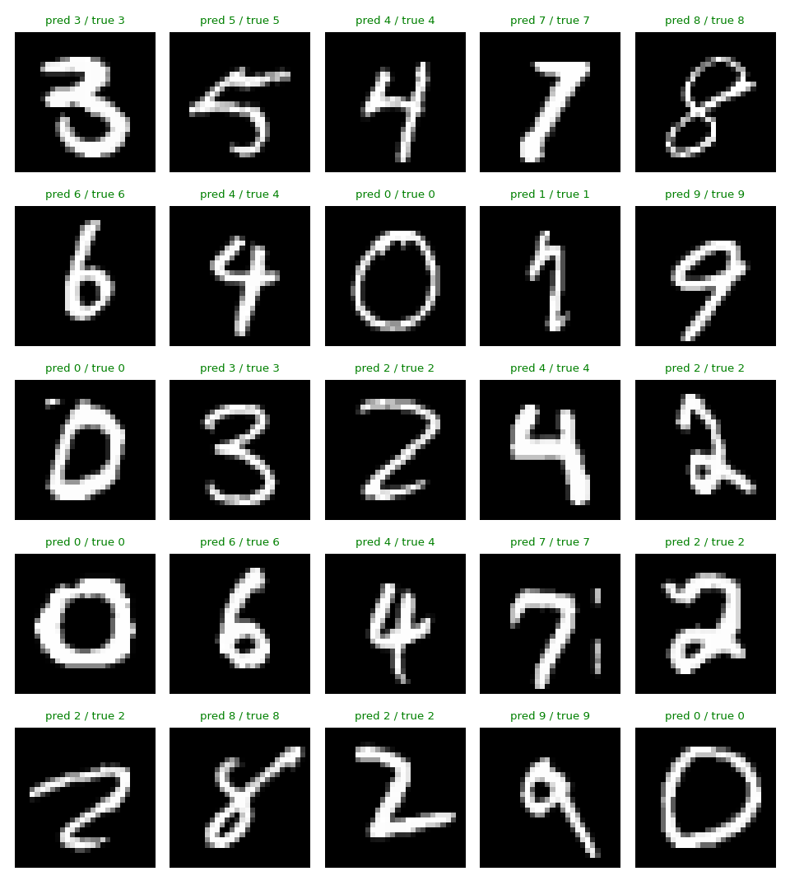

# CNN — Handwritten Digit Classification

A PyTorch CNN that classifies handwritten digits from [MNIST](http://yann.lecun.com/exdb/mnist/). Training data gets augmented with random affine transforms (rotation, translation, scaling, shear) and Gaussian noise, so the model handles digits that are shifted, tilted, or slightly corrupted — not just clean training examples.

Started as a one-day project. This is the cleaned-up version: real model, real training loop, tooling to run inference on your own digits.

<p align="center">
  
</p>

> Predictions on 25 random test digits (green = correct). Generated with `predict.py`.

## Highlights

- **~99.6% test accuracy** on a ~0.47M-parameter VGG-style CNN
- **Augmentation** — affine jitter + Gaussian noise
- **Modern training loop** — AdamW, one-cycle LR, BatchNorm, dropout, held-out validation, best-checkpoint saving
- **Runs anywhere** — CUDA, Apple Silicon (MPS), or CPU, selected automatically
- **Reproducible** — one seed controls data splits and weight init
- **Inference tooling** — classify your own `28×28` image, or render a labelled grid of test predictions

## Architecture

Two conv blocks (each: two `3×3` convs → BatchNorm → ReLU → max-pool → dropout) reduce `28×28` to `7×7` feature maps, then a small FC head:

```
Input 1×28×28
 └─ Conv block 1:  1 →  32 channels   →  32×14×14
 └─ Conv block 2: 32 →  64 channels   →  64× 7× 7
 └─ FC head:      64·7·7 → 128 → 10
```

## Setup

Python 3.9+.

```bash
python -m venv .venv && source .venv/bin/activate
pip install -r requirements.txt
```

MNIST downloads automatically into `data/` on first run.

## Usage

**Train** — saves the best checkpoint to `checkpoints/digitcnn.pt`:

```bash
python src/train.py                 # 15 epochs, default hyperparameters
python src/train.py --epochs 25 --lr 2e-3 --batch-size 256
python src/train.py --no-augment    # clean digits, for comparison
```

Flags: `--epochs`, `--batch-size`, `--lr`, `--weight-decay`, `--dropout`, `--noise-std`, `--no-augment`, `--seed`, `--out`. Full list via `--help`.

**Predict** — labelled grid of random test digits:

```bash
python src/predict.py --grid 25 --out predictions.png
```

Or your own digit (white on black works best; resized to `28×28` automatically):

```bash
python src/predict.py --image my_digit.png
```

## Results

15 epochs on Apple Silicon (MPS):

| Metric              | Value        |
| ------------------- | ------------ |
| Test accuracy       | 99.65%       |
| Validation accuracy | 99.58%       |
| Parameters          | 468,458      |
| Training time       | ~3 min (MPS) |

Augmentation is the main lever. Training on jittered, noisy digits costs a little training accuracy but generalizes noticeably better than the `--no-augment` baseline.

## Project structure

```
src/
  model.py     # DigitCNN architecture
  data.py      # MNIST loading, normalization, affine + noise augmentation
  train.py     # training / validation loop, scheduler, checkpointing  (entry point)
  predict.py   # inference on test samples or your own image
  utils.py     # device selection + reproducible seeding
data/           # MNIST (downloaded automatically)
requirements.txt
```

## License

MIT.
